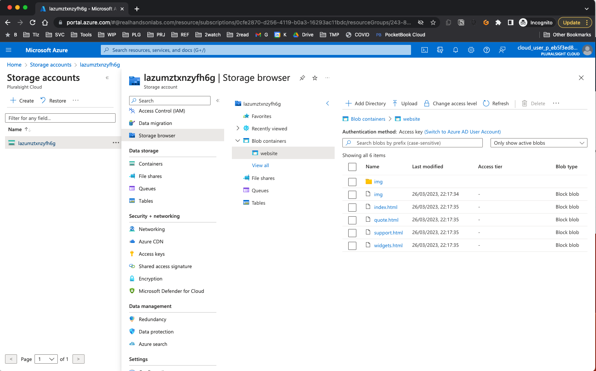

# Storing Container Data in Azure Blob Storage

[Source](https://learn.acloud.guru/handson/7a953ab7-0a36-4d42-a966-478009314500/course/108f9d35-6966-4fb6-a6cd-7af135329bba "Permalink to Storing Container Data in Azure Blob Storage - A Cloud Guru")

## Scenario

While working on upgrading your website from a traditional server to a Docker container, you should explore other options for storing container data. One alternative to storing static content in a Docker volume is to store the data in an Azure Blob Storage container, which is not to be confused with a Docker container! If you are already using Azure, this would allow you to not worry about backing up container data thanks to the data being stored in the Blob Storage container.

You will be using [blobfuse](https://github.com/Azure/azure-storage-fuse), a FUSE-based file system, to mount the Blob Storage container to your server. You'll prepare the server by installing all necessary tools. You'll copy the website data, cloned from [GitHub](https://github.com/linuxacademy/content-widget-factory-inc) into `cloud_user`'s home directory, to the Blob Storage container. You'll use a bind mount to get your Blob Storage container directory into your Docker container. Finally, you'll view the content from a web browser.

## Note

While this method works for static content or content that changes occasionally, this should not be used for frequently written files, such as a database. That would drastically increase latency and drive up your cloud storage costs. You should enable local caching and mount the data as read-only in the container to help mitigate these issues. However, you can use this method for data output if the container processes a job that emits uniquely-named output.

## Lab Goals

1. Obtain Azure authentication credentials
2. Install `blobfuse`.
3. Configure FUSE to allow all users to mount the storage.
4. Create a mount point on the server.
5. Mount the Azure Blob Storage container using blobfuse.
6. Copy the website files to the Blob Storage Container.
7. Verifty that the files are present on the cloud.
8. Run an `httpd` container to serve the website.
9. View the webpage in a browser.

## Logging in to the lab environment

Use the provided username and password to SSH into the server at the public IP.

```
ssh username@public_IP
```

To avoid issues with the lab, use a new Incognito or Private browser window to log in to the Azure portal. This ensures that your personal account credentials, which may be active in your main window, are not used for the lab.

# LOG

```sh
/ $ ssh cloud_user@20.245.48.115

Host '20.245.48.115' is not in the trusted hosts file.
(ssh-ed25519 fingerprint sha1!! c7:53:01:f1:e1:a0:32:b5:5c:f4:2e:e2:b1:25:f7:53:81:c8:ad:23)
Do you want to continue connecting? (y/n) y
cloud_user@20.245.48.115's password:
[cloud_user@lab-VM ~]$ az login
To sign in, use a web browser to open the page https://microsoft.com/devicelogin and enter the code EWXJ953TU to authenticate.

^C[cloud_user@lab-VM ~]$ az storage account list | grep name | head -1
ERROR: Please run 'az login' to setup account.
[cloud_user@lab-VM ~]$ az login
To sign in, use a web browser to open the page https://microsoft.com/devicelogin and enter the code R4R5JA4P6 to authenticate.
[
  {
    "cloudName": "AzureCloud",
    "homeTenantId": "84f1e4ea-8554-43e1-8709-f0b8589ea118",
    "id": "0cfe2870-d256-4119-b0a3-16293ac11bdc",
    "isDefault": true,
    "managedByTenants": [],
    "name": "P4-Real Hands-On Labs",
    "state": "Enabled",
    "tenantId": "84f1e4ea-8554-43e1-8709-f0b8589ea118",
    "user": {
      "name": "cloud_user_p_eb5f3ed8@realhandsonlabs.com",
      "type": "user"
    }
  }
]
[cloud_user@lab-VM ~]$ az storage account list | grep name | head -1
    "name": "lazumztxnzyfh6g",


[cloud_user@lab-VM ~]$ export AZURE_STORAGE_ACCOUNT=lazumztxnzyfh6g
[cloud_user@lab-VM ~]$ az storage account keys list --account-name=$AZURE_STORAGE_ACCOUNT
[
  {
    "creationTime": "2023-03-26T19:55:57.014204+00:00",
    "keyName": "key1",
    "permissions": "FULL",
    "value": "hxIsmQYEc4a5YTqA2zx3555TUJoCP5VqAkEGuXLAU/yJNr/h7IbogKAMChkemZHnNAAsFAKTXNI0+AStb5tisw=="
  },
  {
    "creationTime": "2023-03-26T19:55:57.014204+00:00",
    "keyName": "key2",
    "permissions": "FULL",
    "value": "+46xEtVETxfyKoQLJS0r7ddYgnw1oQH/y0tn3udyqPfI7fPXxGvfmpS8VWIXDeeUHNWIwnvMOOmW+AStXXm3Mg=="
  }
]
[cloud_user@lab-VM ~]$ export AZURE_STORAGE_ACCESS_KEY="hxIsmQYEc4a5YTqA2zx3555TUJoCP5VqAkEGuXLAU/yJNr/h7IbogKAMChkemZHnNAAsFAKTXNI0+AStb5tisw=="
[cloud_user@lab-VM ~]$ export AZURE_STORAGE_ACCESS_KEY=hxIsmQYEc4a5YTqA2zx3555TUJoCP5VqAkEGuXLAU/yJNr/h7IbogKAMChkemZHnNAAsFAKTXNI0+AStb5tisw==
[cloud_user@lab-VM ~]$ sudo rpm -Uvh https://packages.microsoft.com/config/rhel/7/packages-microsoft-prod.rpm

We trust you have received the usual lecture from the local System
Administrator. It usually boils down to these three things:

    #1) Respect the privacy of others.
    #2) Think before you type.
    #3) With great power comes great responsibility.

[sudo] password for cloud_user:
Retrieving https://packages.microsoft.com/config/rhel/7/packages-microsoft-prod.rpm
Preparing...                          ################################# [100%]
Updating / installing...
   1:packages-microsoft-prod-1.0-1.el7################################# [100%]
[cloud_user@lab-VM ~]$ sudo yum install blobfuse fuse -y
Loaded plugins: fastestmirror, langpacks
Loading mirror speeds from cached hostfile
 * base: mirrors.ocf.berkeley.edu
 * epel: mirrors.ocf.berkeley.edu
 * extras: centos.mirror.shastacoe.net
 * updates: mirrors.unifiedlayer.com
packages-microsoft-com-prod                                                                                                           | 1.5 kB  00:00:00
packages-microsoft-com-prod/primary                                                                                                   | 297 kB  00:00:00
packages-microsoft-com-prod                                                                                                                        1555/1555
Resolving Dependencies
--> Running transaction check
---> Package blobfuse.x86_64 0:1.3.6-1.el7 will be installed
--> Processing Dependency: libfuse.so.2(FUSE_2.5)(64bit) for package: blobfuse-1.3.6-1.el7.x86_64
--> Processing Dependency: libfuse.so.2(FUSE_2.6)(64bit) for package: blobfuse-1.3.6-1.el7.x86_64
--> Processing Dependency: libfuse.so.2(FUSE_2.8)(64bit) for package: blobfuse-1.3.6-1.el7.x86_64
--> Processing Dependency: libboost_filesystem-mt.so.1.53.0()(64bit) for package: blobfuse-1.3.6-1.el7.x86_64
--> Processing Dependency: libfuse.so.2()(64bit) for package: blobfuse-1.3.6-1.el7.x86_64
---> Package fuse.x86_64 0:2.9.2-11.el7 will be installed
--> Running transaction check
---> Package boost-filesystem.x86_64 0:1.53.0-28.el7 will be installed
---> Package fuse-libs.x86_64 0:2.9.2-11.el7 will be installed
--> Finished Dependency Resolution

Dependencies Resolved

=============================================================================================================================================================
 Package                               Arch                        Version                            Repository                                        Size
=============================================================================================================================================================
Installing:
 blobfuse                              x86_64                      1.3.6-1.el7                        packages-microsoft-com-prod                      3.5 M
 fuse                                  x86_64                      2.9.2-11.el7                       base                                              86 k
Installing for dependencies:
 boost-filesystem                      x86_64                      1.53.0-28.el7                      base                                              68 k
 fuse-libs                             x86_64                      2.9.2-11.el7                       base                                              93 k

Transaction Summary
=============================================================================================================================================================
Install  2 Packages (+2 Dependent packages)

Total download size: 3.7 M
Installed size: 15 M
Downloading packages:
(1/4): boost-filesystem-1.53.0-28.el7.x86_64.rpm                                                                                      |  68 kB  00:00:00
(2/4): fuse-libs-2.9.2-11.el7.x86_64.rpm                                                                                              |  93 kB  00:00:00
(3/4): blobfuse-1.3.6-RHEL-7.5-x86_64.rpm                                                                                             | 3.5 MB  00:00:01
(4/4): fuse-2.9.2-11.el7.x86_64.rpm                                                                                                   |  86 kB  00:00:01
-------------------------------------------------------------------------------------------------------------------------------------------------------------
Total                                                                                                                        2.5 MB/s | 3.7 MB  00:00:01
Running transaction check
Running transaction test
Transaction test succeeded
Running transaction
Warning: RPMDB altered outside of yum.
  Installing : boost-filesystem-1.53.0-28.el7.x86_64                                                                                                     1/4
  Installing : fuse-2.9.2-11.el7.x86_64                                                                                                                  2/4
  Installing : fuse-libs-2.9.2-11.el7.x86_64                                                                                                             3/4
  Installing : blobfuse-1.3.6-1.el7.x86_64                                                                                                               4/4
  Verifying  : blobfuse-1.3.6-1.el7.x86_64                                                                                                               1/4
  Verifying  : fuse-libs-2.9.2-11.el7.x86_64                                                                                                             2/4
  Verifying  : fuse-2.9.2-11.el7.x86_64                                                                                                                  3/4
  Verifying  : boost-filesystem-1.53.0-28.el7.x86_64                                                                                                     4/4

Installed:
  blobfuse.x86_64 0:1.3.6-1.el7                                                  fuse.x86_64 0:2.9.2-11.el7

Dependency Installed:
  boost-filesystem.x86_64 0:1.53.0-28.el7                                           fuse-libs.x86_64 0:2.9.2-11.el7

Complete!
[cloud_user@lab-VM ~]$ sudo sed -ri 's/# user_allow_other/user_allow_other/' /etc/fuse.conf
[cloud_user@lab-VM ~]$ cat /etc/fuse.conf
# mount_max = 1000
user_allow_other

[cloud_user@lab-VM ~]$ sudo mkdir -p /mnt/widget-factory /mnt/blobfusetmp
[cloud_user@lab-VM ~]$ sudo chown cloud_user /mnt/widget-factory/ /mnt/blobfusetmp/
[cloud_user@lab-VM ~]$ blobfuse /mnt/widget-factory --container-name=website --tmp-path=/mnt/blobfusetmp -o allow_other
[cloud_user@lab-VM ~]$ ll /mnt/widget-factory/
total 0
[cloud_user@lab-VM ~]$ ll /mnt/
total 4
drwxr-xr-x. 3 cloud_user root         18 Mar 26 20:17 blobfusetmp
drwxr-xr-x. 3 root       root         20 Feb 16  2022 cdrom
drwxr-xr-x. 3 root       root       4096 Mar 26 19:56 resource
drwxrwxrwx. 2 cloud_user cloud_user 4096 Mar 26 20:17 widget-factory
[cloud_user@lab-VM ~]$ cp -r ~/widget-factory-inc/web/* /mnt/widget-factory/
[cloud_user@lab-VM ~]$ ll /mnt/widget-factory/
total 16
drwxrwxrwx. 2 cloud_user cloud_user   76 Mar 26 20:17 img
-rwxrwxrwx. 1 cloud_user cloud_user 3059 Mar 26 20:17 index.html
-rwxrwxrwx. 1 cloud_user cloud_user 2910 Mar 26 20:17 quote.html
-rwxrwxrwx. 1 cloud_user cloud_user 2611 Mar 26 20:17 support.html
-rwxrwxrwx. 1 cloud_user cloud_user 2645 Mar 26 20:17 widgets.html
[cloud_user@lab-VM ~]$ az storage blob list -c website --output table

There are no credentials provided in your command and environment, we will query for account key for your storage account.
It is recommended to provide --connection-string, --account-key or --sas-token in your command as credentials.

You also can add `--auth-mode login` in your command to use Azure Active Directory (Azure AD) for authorization if your login account is assigned required RBAC roles.
For more information about RBAC roles in storage, visit https://docs.microsoft.com/azure/storage/common/storage-auth-aad-rbac-cli.

In addition, setting the corresponding environment variables can avoid inputting credentials in your command. Please use --help to get more information about environment variable usage.
Name                  Blob Type    Blob Tier    Length    Content Type              Last Modified              Snapshot
--------------------  -----------  -----------  --------  ------------------------  -------------------------  ----------
img                   BlockBlob                           application/octet-stream  2023-03-26T20:17:34+00:00
img/LargeWidget.png   BlockBlob                 3887      application/octet-stream  2023-03-26T20:17:35+00:00
img/MediumWidget.png  BlockBlob                 2971      application/octet-stream  2023-03-26T20:17:35+00:00
img/SmallWidget.png   BlockBlob                 3482      application/octet-stream  2023-03-26T20:17:35+00:00
index.html            BlockBlob                 3059      application/octet-stream  2023-03-26T20:17:35+00:00
quote.html            BlockBlob                 2910      application/octet-stream  2023-03-26T20:17:35+00:00
support.html          BlockBlob                 2611      application/octet-stream  2023-03-26T20:17:35+00:00
widgets.html          BlockBlob                 2645      application/octet-stream  2023-03-26T20:17:35+00:00
[cloud_user@lab-VM ~]$ docker run -d --name web1 -p 80:80 --mount type=bind,source=/mnt/widget-factory,target=/usr/local/apache2/htdocs,readonly httpd:2.4
633c8c9b8ecc989119c4a40e62b6648565b4d24807907294479a727f0a85fd54
[cloud_user@lab-VM ~]$ docker ps
CONTAINER ID   IMAGE       COMMAND              CREATED         STATUS         PORTS                               NAMES
633c8c9b8ecc   httpd:2.4   "httpd-foreground"   4 seconds ago   Up 3 seconds   0.0.0.0:80->80/tcp, :::80->80/tcp   web1

```

I also did a review in the console - 


