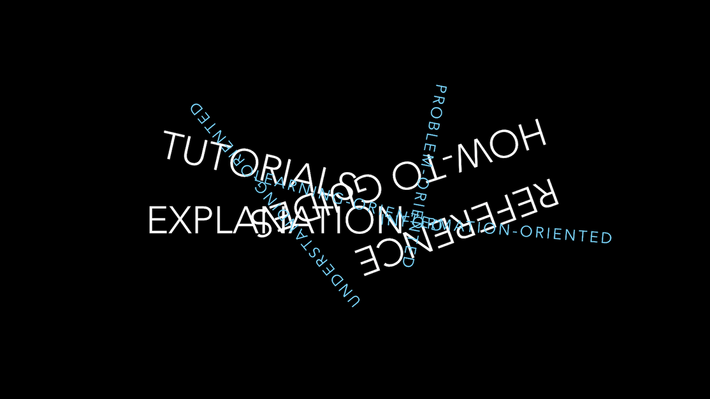

# Documentation

The design and layout of the documentation is based on the principles described [here](https://documentation.divio.com/)

In a nutshell:

Documentation needs to include and be structured around its four different functions: tutorials, how-to guides, technical reference and explanation.

Each of them requires a distinct mode of writing.

People working with software need these four different kinds of documentation at different times, in different circumstances - so software usually needs them all, and they should all be integrated into your documentation.

And documentation needs to be explicitly structured around them, and they all must be kept separate and distinct from each other.

Each of these kinds of documentation has only one job.

## Tutorials

Tutorials are lessons that take the reader by the hand through a series of steps to complete a project of some kind. They are what your project needs in order to show a beginner that they can achieve something with it.

They are wholly learning-oriented, and specifically, they are oriented towards learning how rather than learning that.

You are the teacher, and you are responsible for what the student will do. Under your instruction, the student will execute a series of actions to achieve some end.

The end and the actions are up to you, but deciding what they should be can be hard work. The end has to be meaningful, but also achievable for a complete beginner.

### Analogy from cooking - Tutorial

Consider an analogy of teaching a child to cook.

What you teach the child to cook isn’t really important. What’s important is that the child finds it enjoyable, and gains confidence, and wants to do it again.

Through the things the child does, it will learn important things about cooking. It will learn what it is like to be in the kitchen, to use the utensils, to handle the food.

This is because using software, like cooking, is a matter of craft. It’s knowledge - but it is practical knowledge, not theoretical knowledge.

When we learn a new craft or skill, we always begin learning it by doing.

See [more](https://documentation.divio.com/tutorials/)

## How-to guides

How-to guides take the reader through the steps required to solve a real-world problem.

They are recipes, directions to achieve a specific end - for example: how to create a web form; how to plot a three-dimensional data-set; how to enable LDAP authentication.

They are wholly goal-oriented.

How-to guides are wholly distinct from tutorials and must not be confused with them:

A tutorial is what you decide a beginner needs to know.

A how-to guide is an answer to a question that only a user with some experience could even formulate.

In a how-to guide, you can assume some knowledge and understanding. You can assume that the user already knows how to do basic things and use basic tools.

### Analogy from cooking - How-To

Think about a recipe, for preparing something to eat.

A recipe has a clear, defined end. It addresses a specific question. It shows someone - who can be assumed to have some basic knowledge already - how to achieve something.

Someone who has never cooked before can’t be expected to follow a recipe with success, so a recipe is not a substitute for a cooking lesson. At the same time, someone who reads a recipe would be irritated to find that it tries to teach basics that they know already, or contains irrelevant discussion of the ingredients.

See [more](https://documentation.divio.com/how-to-guides/)

## Reference guides

Reference guides are technical descriptions of the machinery and how to operate it.

Reference guides have one job only: to describe. They are code-determined, because ultimately that’s what they describe: key classes, functions, APIs, and so they should list things like functions, fields, attributes and methods, and set out how to use them.

Reference material is information-oriented.

By all means technical reference can contain examples to illustrate usage, but it should not attempt to explain basic concepts, or how to achieve common tasks.

Reference material should be austere and to the point.

Note that description does include basic description of how to use the machinery - how to instantiate a particular class, or invoke a certain method, for example, or precautions that must be taken when passing something to a function. However this is simply part of its function as technical reference, and emphatically not to be confused with a how-to guide - describing correct usage of software (technical reference) is not the same as showing how to use it to achieve a certain end (how-to documentation).

### Analogy from cooking - reference

Consider an encyclopaedia article about an ingredient, say ginger.

When you look up ginger in a reference work, what you want is information about the ingredient - information describing its provenance, its behaviour, its chemical constituents, how it can be cooked.

You expect that whatever ingredient you look up, the information will be presented in a similar way. And you expect to be informed of basic facts, such as ginger is a member of the family that includes turmeric and cardamom.

This is also where you’d expect to be alerted about potential problems, such as: ginger is known to provoke heartburn in some individuals or: ginger may interfere with the effects of anticoagulants, such as warfarin or aspirin.

See [more](https://documentation.divio.com/reference/)

## Explanation

Explanation, or discussions, clarify and illuminate a particular topic.
They broaden the documentation’s coverage of a topic.

They are understanding-oriented.

Explanations can equally well be described as discussions; they are discursive in nature. They are a chance for the documentation to relax and step back from the software, taking a wider view, illuminating it from a higher level or even from different perspectives. You might imagine a discussion document being read at leisure, rather than over the code.

This section of documentation is rarely explicitly created, and instead, snippets of explanation are scattered amongst other sections.

### Analogy from cooking - explanation

Think about a work that discusses food and cooking in the context of history, science and technology. It’s about cooking and the kitchen.

It doesn’t teach, it’s not a collection of recipes, and it doesn’t just describe.

Instead, it analyses, considers things from multiple perspectives. It might explain why it is we now do things the way we do, or even describe bad ways of doing things, or obscure alternatives.

It deepens our knowledge and makes it richer, even if it isn’t knowledge we can actually apply in any practical sense - but it doesn’t need to be, in order to be valuable.

It’s something we might read at our leisure, away from the kitchen itself, when we want to think about cooking at a higher level, and to understand more about the subject.

See [more](https://documentation.divio.com/explanation/)

## Summary

Each of the quadrants is similar to its two neighbours:

* tutorials and how-to guides are both concerned with describing practical steps
* how-to guides and technical reference are both what we need when we are at work, coding
* reference guides and explanation are both concerned with theoretical knowledge
* tutorials and explanation are both most useful when we are studying, rather than actually working

In the above classification, this document is an Explanation with links to the other parts.

To find out more how to write a good type of documentation, refer to the links above.

An example of the documentation written using this structure [is here](https://docs.divio.com/en/latest/background/environments/). It uses slightly modified names for the categories:

* Getting Started => Tutorials
* How-tos
* Reference
* Background => Explanations

## Common issues

There is a natural gravitational pull of these distinct types of documentation to each other, and it is hard to resist

## Naming convention

We will us the following prefixes for the Mardown names:

* `tut-` = Getting started, tutorial
* `how-to-` = How To
* `ref-` = Reference
* `bkg-` = Background, aka Explanation