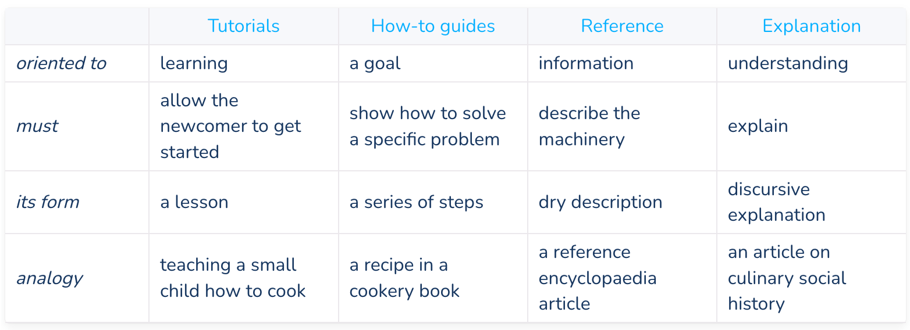
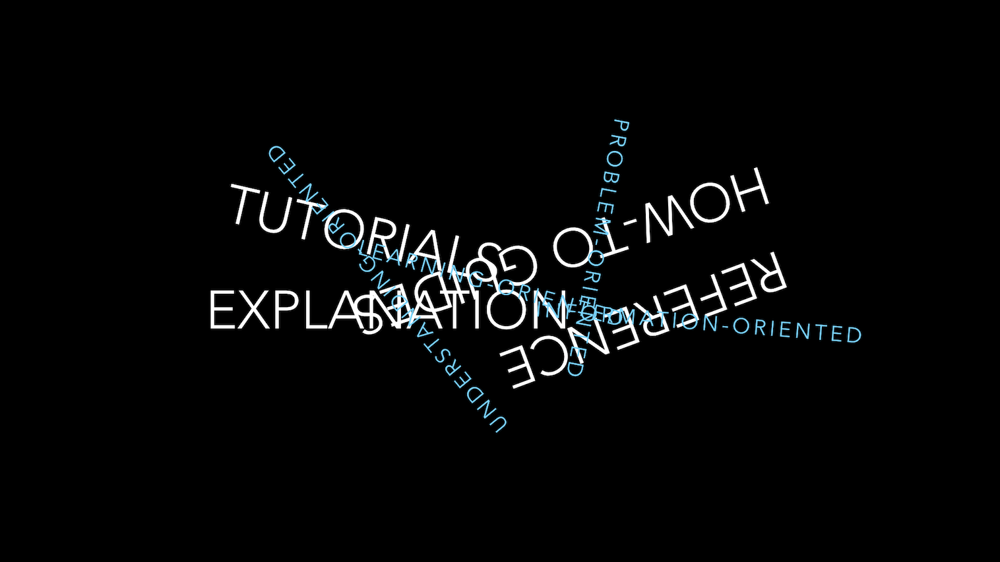

# Documentation structure

Documentation needs to include and be structured around its four different functions: tutorials, how-to guides, technical reference and explanation. Each of these kinds of documentation has only one job

---

## In a nutshell

---
## Tutorials

* Guide the reader by the hand through a series of steps to complete a project of some kind. 

* wholly learning-oriented, towards learning how 

* the student will execute a series of actions to achieve some end.

* the end has to be meaningful, but also achievable for a complete beginner.

---

### Analogy from cooking - Tutorial

Consider an analogy of teaching to cook.

* What you teach to cook isn’t really important. 
* What’s important is that student finds it enjoyable, and gains confidence, and wants to do it again.
* will learn important things about cooking -  what it is like to be in the kitchen, to use the utensils, to handle the food.

* When we learn a new craft or skill, we  begin learning it by doing.

See [more](https://documentation.divio.com/tutorials/)

---
## How-to guides

* takes the reader through the steps needed to solve a problem.
* They are recipes, directions to achieve a specific end 
* They are wholly goal-oriented.

How-to guides are wholly distinct from tutorials:

* A tutorial is what you decide a beginner needs to know.
* A how-to guide is an answer to a question that only a user with some experience could even formulate.
* In a how-to guide, you can assume some knowledge and understanding. 

---
### Analogy from cooking - How-To

* Think about a recipe, for preparing something to eat.
    * A recipe has a clear, defined end. 
    * It addresses a specific question. 
* It shows someone - who has some basic knowledge already - how to achieve something.
* Someone who never cooked before can’t follow a recipe
* => recipe is not a substitute for a cooking lesson. 
* someone who reads a recipe does not need to to teach basics

See [more](https://documentation.divio.com/how-to-guides/)

---
## Reference guides

* technical descriptions of the machinery and how to operate it.
* have one job only: to describe. 
* Reference material is information-oriented.

* should contain examples to illustrate usage
* it should not explain basic concepts, or how to achieve common tasks.
* not to be confused with a how-to guide - describing correct usage of software (technical reference) is not the same as showing how to use it to achieve a certain end (how-to documentation).

---
### Analogy from cooking - reference

* Consider an encyclopaedia article about an ingredient, say ginger.
* reference work gives you information about the ingredient - its provenance, its behaviour, its  constituents, how it can be cooked.
* You expect that whatever ingredient you look up, the information will be presented in a similar way. 
* you expect to be informed of basic facts (ginger is a member of the family that includes turmeric and cardamom.)
* you’d expect to be alerted about potential problems, such as: ginger ican provoke heartburn 

See [more](https://documentation.divio.com/reference/)

---
## Explanation

* clarify and illuminate a particular topic.
* broaden the documentation’s coverage of a topic.
* They are understanding-oriented.
* taking a wider view, illuminating it from a higher level or even from different perspectives. 

This section of documentation is rarely explicitly created, and instead, snippets of explanation are scattered amongst other sections.

---
### Analogy from cooking - explanation

* work that discusses food and cooking in the context of history, science and technology. It’s about cooking and the kitchen.
* It doesn’t teach, it’s not a collection of recipes, and it doesn’t just describe.
* it analyses from multiple perspectives: why it is we now do things the way we do, or even describe bad ways of doing things
* It deepens our knowledge and makes it richer, even if it isn’t knowledge we can actually apply in any practical sense - but it doesn’t need to be, in order to be valuable.

See [more](https://documentation.divio.com/explanation/)

---

## Summary

Each of the quadrants is similar to its two neighbours:

* tutorials and how-to guides describe practical steps
* how-to guides and technical reference we need when we code
* reference guides and explanation focus on theoretical knowledge
* tutorials and explanation are most useful for studying

---

## Example

An example of the documentation written using this structure [is here](https://docs.divio.com/en/latest/background/environments/). It uses slightly modified names for the categories:

* Getting Started => Tutorials
* How-tos
* Reference
* Background => Explanations

---
## Common issues

There is a natural gravitational pull of these distinct types of documentation to each other, and it is hard to resist

---

## Naming convention

We will us the following prefixes for the Mardown names:

* `tut-` = Getting started, tutorial
* `how-to-` = How To
* `ref-` = Reference
* `bkg-` = Background, aka Explanation