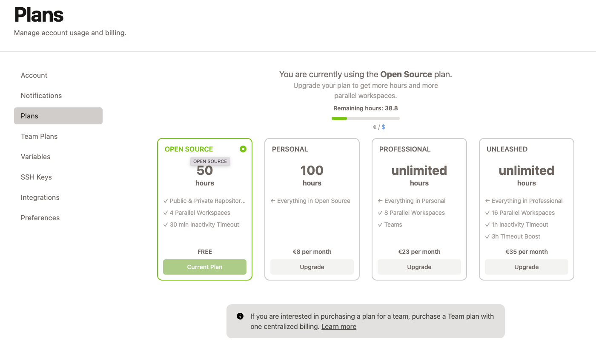
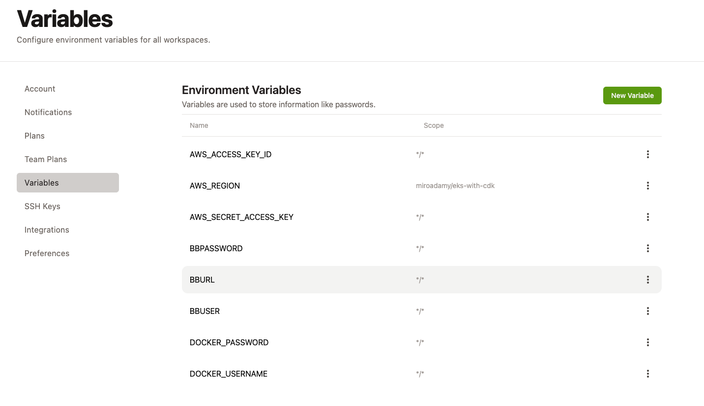

# Gitpod

Ephemeral development environment in the container

See https://www.gitpod.io/docs

To get started, install extension for Github, Bitbucket and Gitlab - Gitpod browser extension in any [Chromium-based browser](https://chrome.google.com/webstore/detail/gitpod-online-ide/dodmmooeoklaejobgleioelladacbeki) such as Google Chrome, Microsoft Edge, Brave, and others, or in Firefox

## Getting started

Then open a repository in container from the browser:


to get to environment like this:


It is essentially an Visual Studio Code in the cloud.




### Logo for Readme

Code to contribute:

<a href="https://gitpod.io/#<your-project-url>">
  
</a>


```html
<a href="https://gitpod.io/#<your-project-url>">
  
</a>
```

Or

[](https://gitpod.io/#<your-project-url>)

```markdown
[](https://gitpod.io/#<your-project-url>)
```

## Configuration

### Variables



### Starting templates:

* https://www.gitpod.io/docs/quickstart/typescript
* https://www.gitpod.io/docs/quickstart/go
* https://www.gitpod.io/docs/quickstart/docker-compose
* https://www.gitpod.io/docs/quickstart/flask

