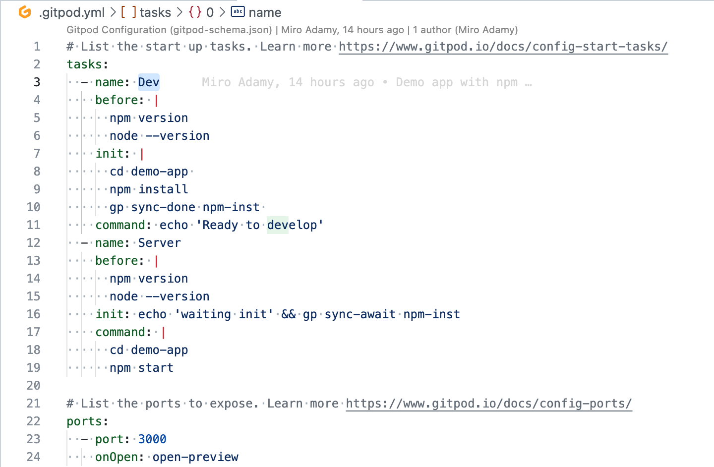

# Gitpod

Ephemeral development environment in the container

See https://www.gitpod.io/docs

To get started, install extension for Github, Bitbucket and Gitlab

Works with browser extension in any [Chromium-based browser](https://chrome.google.com/webstore/detail/gitpod-online-ide/dodmmooeoklaejobgleioelladacbeki) (Google Chrome, Microsoft Edge, Brave) or in Firefox

---

# Open a workspace

Then open a repository in container from the browser:

---
# Open a workspace - no plugin

Prefix URL with https://gitpod.io/#
Must be logged in both - BB and Gitpod
Use Web URL, not clone URL:

* OK : https://bitbucket.org/pivotree/oneclick-security/src/master/ 
* Not OK: https://miro-adamy-PVT@bitbucket.org/pivotree/oneclick-security.git

`https://gitpod.io/#https://bitbucket.org/
 pivotree/oneclick-security/src/master/`

---
# Environment
It is essentially an Visual Studio Code in the cloud.

---
# Its free(mium)

---

# Workspaces

* your own source code copy in container
* can have multiple, even parallel (plan)
* can be shared, downloaded, snapshot
* co-development
* only FS under `/workspace` is preserved between runs
---

# Configuration

* can install packages - even sudo
* access to Docker and Dockercompose
* `gitpod/worspace-full` and `gitpod/workspace-base`

* lang-c,lang-clojure, lang-go:1.17.5, lang-java:11
* lang-node:16.13.2
* lang-python, lang-ruby:2.7, lang-rust
* tool-brew, tool-nginx, tool-nix:2.3.14
---

# Variables

Available to one or more containers

---

# Automation

`.gitpod.yml` - runs on workspace creation / restart

---
# Prebuilds

Enable prebuild: New Project - https://gitpod.io/new

New Workspace:
* with prebuild: BEFORE + COMMAND
* no prebuild:  BEFORE + INIT + COMMAND

Restart workspace (with or w/o Prebuild): BEFORE + COMMAND
Start snapshot: BEFORE + COMMAND

See https://www.gitpod.io/docs/prebuilds

---

# gp CLI

`gp help`
`gp init`
`gp ports`
`gp url 3000`
`gp env foo=bar`
`eval $(gp env -e foo=bar)` => update the variable AND terminal

---

# Ports

* specify in gitpod.yml
* `gp port list`
* `gp url PORT` => URL
   * can be public or private

---
# Sharing and connectivity

* can share live environment => Token URL
* can share snapshot
* can add public key and use SSH
* can get public URL with token (connect for shared access)
* can open a port for public or private remote access

---

# Custom images

As part of `.gitpod.yml` - use custom Docker file

---

# Multi-repo projects

Multiple workspaces - OK is browser is only client
Backend-integrations: Tailscale - https://tailscale.com/

See https://www.gitpod.io/guides/connect-multiple-repositories-using-tailscale